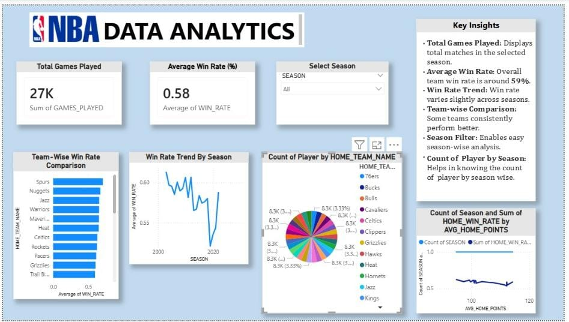
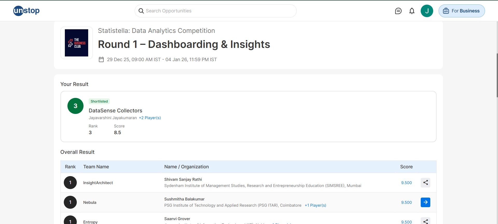

# NBA Analytics Dashboard

An end-to-end data analytics project exploring NBA game statistics, player performance, and team trends using Python and Power BI.

---

## Competition Achievement

🏆 Developed this dashboard for the **Statistella Data Analytics Competition (IIT BHU, Varanasi)**, where our team secured **3rd Rank in Round 1**.

### Dashboard & Result

<p align="center">
  
</p>

<p align="center">
  
</p>

---

## Dataset

Data sourced from Kaggle: [NBA Games Dataset](https://www.kaggle.com/datasets/nathanlauga/nba-games)

| File | Description |
|---|---|
| `games.csv` | Game-level results and team stats (2003–2022) |
| `games_details.csv` | Player-level box scores per game |
| `players.csv` | Player–team–season mapping |
| `ranking.csv` | Daily standings per team per season |
| `teams.csv` | Team metadata (arena, coach, GM, etc.) |

---

## Project Structure

```
nba-analytics-dashboard/
│
├── data/
│   ├── raw/                  
│   └── processed/           
│
├── notebooks/
│   ├── 01_data_loading_and_cleaning.ipynb
│   └── 02_feature_engineering_and_eda.ipynb
│
├── dashboard/                # Power BI dashboard files
│
├── requirements.txt
├── LICENSE.txt
└── README.md
```

---

## Setup

### 1. Clone the repository
```bash
git clone https://github.com/Jayavarshini-Jayakumaran/nba-exploratory-data-analysis.git
cd nba-exploratory-data-analysis
```

### 2. Create and activate a virtual environment
```bash
python -m venv venv

# Windows
venv\Scripts\activate

# macOS/Linux
source venv/bin/activate
```

### 3. Install dependencies
```bash
pip install -r requirements.txt
```

### 4. Add raw data
Download the dataset from Kaggle and place the CSV files inside `data/raw/`.

### 5. Run the notebooks in order
```
notebooks/01_data_loading_and_cleaning.ipynb
notebooks/02_feature_engineering_and_eda.ipynb
```

---

## Notebooks

### 01 — Data Loading & Cleaning
- Loads all 5 raw CSVs
- Converts `MIN` (minutes played) from `MM:SS` string to float
- Handles nulls: fills `START_POSITION`, `COMMENT`, `NICKNAME`, `PLUS_MINUS`
- Parses dates, engineers `GAME_RESULT` and `TOTAL_POINTS`
- Splits `HOME_RECORD` / `ROAD_RECORD` into numeric win/loss columns
- Exports cleaned CSVs to `data/processed/`

### 02 — Feature Engineering & EDA
- Merges game data with team metadata
- Engineers features: `POINT_DIFF`, `WINNING_TEAM`, `HOME_WIN`, `AWAY_WIN`
- Aggregates season-level, team-level, and player-level summaries
- Exports final analytical tables to `data/processed/`

---

## Output Files (data/processed/)

| File | Description |
|---|---|
| `games_details_cleaned.csv` | Cleaned player box scores |
| `games_cleaned.csv` | Cleaned game results |
| `games_with_teams.csv` | Games enriched with team metadata |
| `games_features.csv` | Feature-engineered games table |
| `team_stats.csv` | Per-team per-season aggregates |
| `home_away_summary.csv` | Home vs away win rates by season |
| `season_summary.csv` | Season-level scoring and win rate trends |
| `player_summary.csv` | Per-player per-season averages (min 20 games) |
| `players_cleaned.csv` | Cleaned players table |
| `ranking_cleaned.csv` | Cleaned standings with parsed record columns |
| `teams_cleaned.csv` | Cleaned teams metadata |

---

🙌 **Connect** — [LinkedIn: Jayavarshini Jayakumaran](https://www.linkedin.com/in/jayavarshini-jayakumaran)

📄 **License** — [MIT](LICENSE)

<p align="center"><b>Finish what you started 💻 </b></p>
